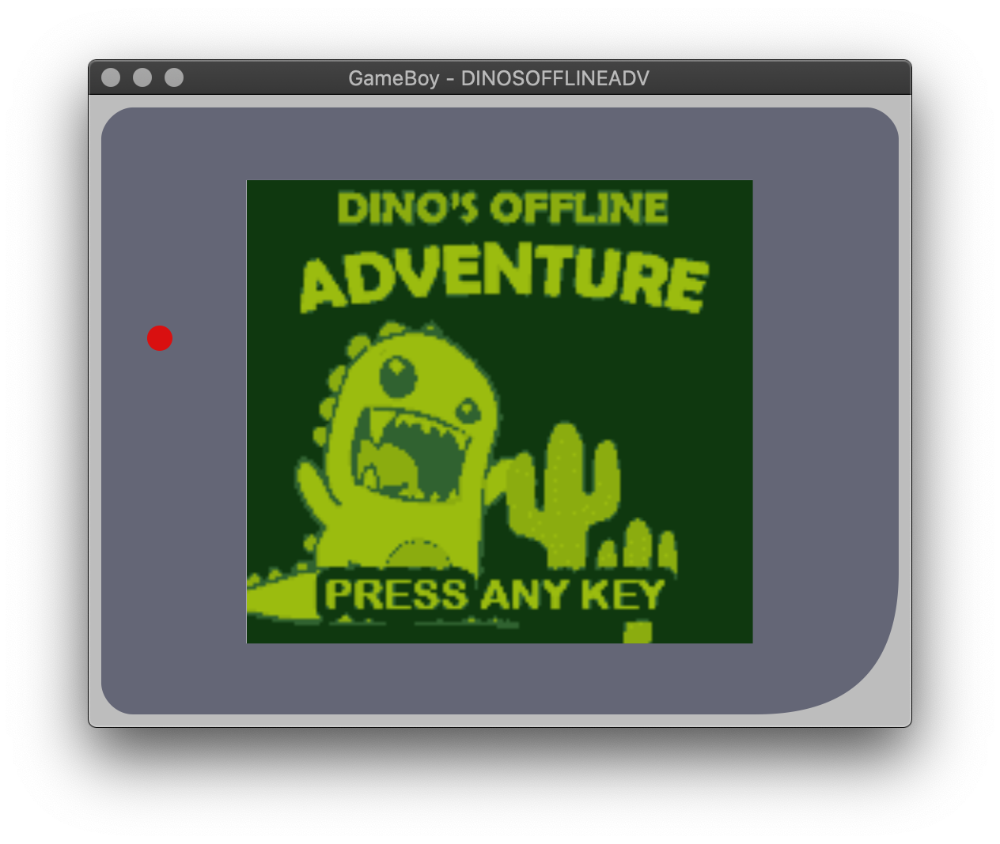
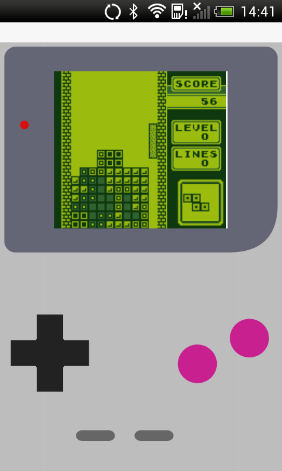

# FyneGameboy
🕹️ `FyneGameboy` is a Gameboy emulator GUI based on the [GameBoy.Live](https://github.com/HFO4/gameboy.live) project by HFO4.
With this project you can play your favourite GameBoy games on desktop, mobile and beyond.

## Installation

You can build the app using Go Version 1.12 or higher as shown below.
On Debian based systems, the packages `libasound2-dev` and `libgl1-mesa-dev` must be installed.

```
git clone https://github.com/andydotxyz/fynegameboy.git
cd fynegameboy
go build main.go
```

## Usage

```
Usage of gbdotlive:
  -d    Use Debugger in GUI mode
  -f FPS
        Set the FPS (default 60)
  -h    This help
  -m    Turn on sound (default true)
```

### Running

Play a specified ROM file in GUI mode:

```bash
$ fynegameboy "Tetris.gb" 
```

Alternatively you can just run the application and play
[Dino's Offline Adventure](https://github.com/gingemonster/DinosOfflineAdventure).
Many thanks to [Brian Norman](https://github.com/gingemonster) for permission to embed the game.



### Mobile

This app also supports a touchscreen configuration for mobile devices.
To build for a mobile device you need to use the `fyne` tool's package function:

```bash
$ go get fyne.io/fyne/cmd/fyne
$ fyne package -os android -appID xyz.andy.fynegameboy
$ adb install fynegameboy
```



*The Tetris game is not associated with this repository*

## Keyboard instruction

| Keyboard | Gameboy |
| -------- | ------- |
| <kbd>Enter</kbd>     | Start   |
|<kbd>Backspace</kbd>  | Select  |
| <kbd>↑</kbd>  | Up      |
|  <kbd>↓</kbd> | Down    |
|   <kbd>←</kbd> | Left    |
|   <kbd>→</kbd>  | Right   |
|    <kbd>X</kbd>  | A      |
|     <kbd>Z</kbd>     | B      |

## Features & TODOs

- [x] CPU instruction emulation
- [x] Timer and interrupt
- [x] Support for ROM-only, MBC1, MBC2, MBC3 cartridge
- [x] Sound emulation
- [x] Graphics emulation
- [x] Cloud gaming
- [x] ROM debugger
- [x] Game saving & restore in cartridge level

There are still many TODOs：

- [ ] Support save and load of emulator state

And we'd love to help upstream project with:

- [ ] Support Gameboy Color emulation
- [ ] Support for MBC4, MBC5, HuC1 cartridge
- [ ] Sound simulation is incomplete, still got differences compared to the Gameboy real machine
- [ ] Sprite priority issue (see `Wario Land II` and `Metroid II: Return of Samus`)
